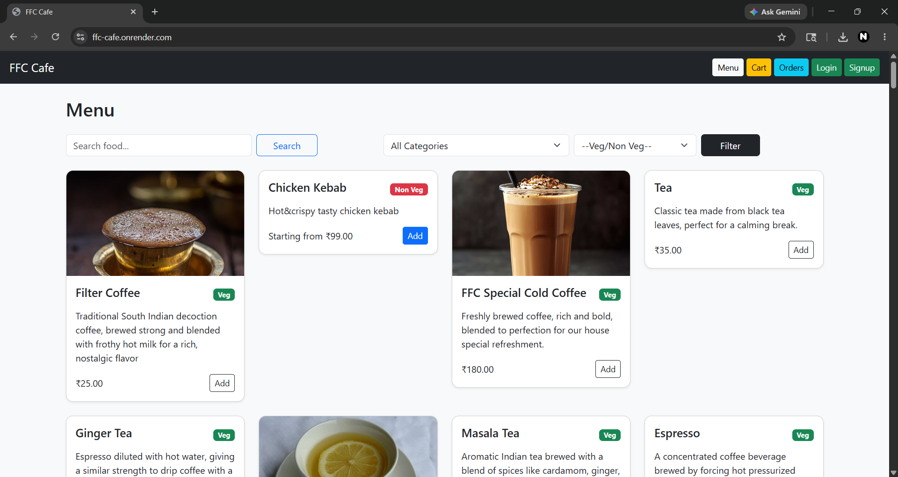
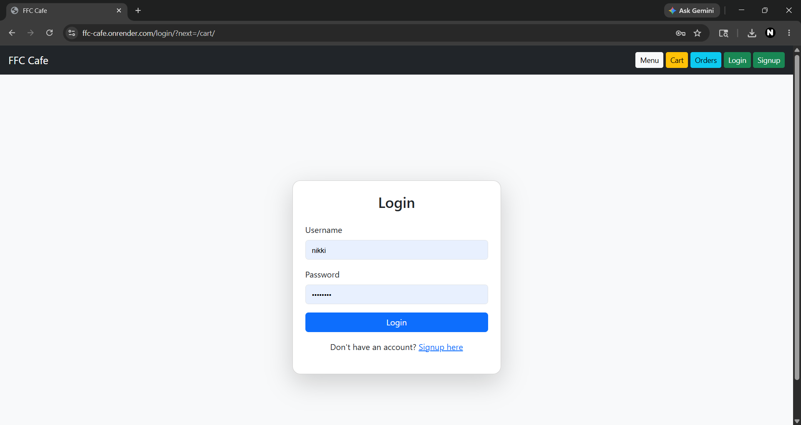
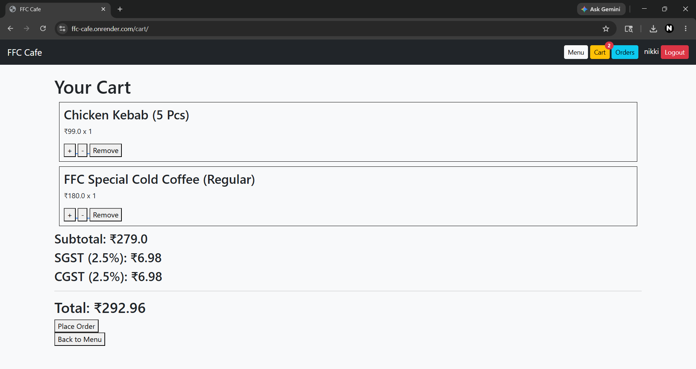
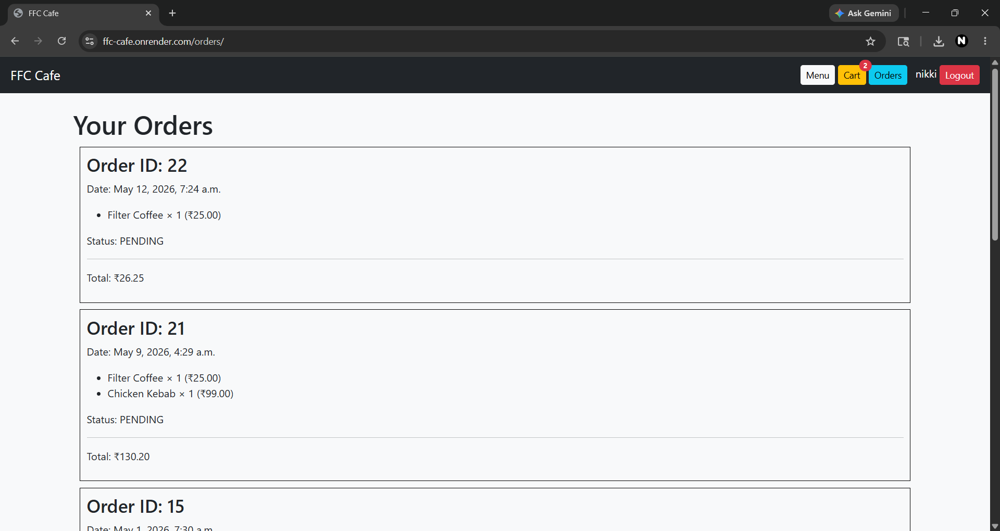

# Restaurant Management System

A full-stack restaurant ordering web application built using Django, Bootstrap, JavaScript, and SQLite.

---

## Features

- Food ordering system
- Dynamic cart functionality
- Razorpay payment integration
- Food search functionality
- Responsive mobile-friendly UI
- Session-based cart management
- Menu item variants and pricing

---

## Technologies Used

- Python
- Django
- HTML5
- CSS3
- Bootstrap
- JavaScript
- SQLite

---

## Screenshots

### Home Page


### login Page


### Signup Page


### Cart Page


### order history Page


---

## Installation

```bash
git clone https://github.com/yourusername/restaurant-management-system.git

cd restaurant-management-system

pip install -r requirements.txt

python manage.py runserver
```

---

## Future Improvements

- Real-time order tracking
- User authentication system
- Admin analytics dashboard
- Email notifications
- Order history

---

## Author

Nikhil S
